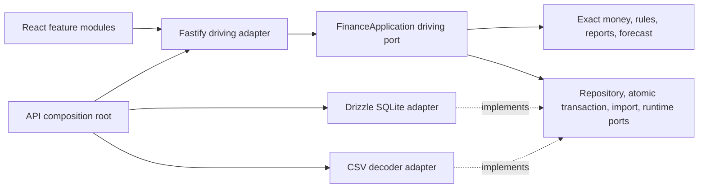

# Architecture

The dependency direction is inward. The domain and application packages have no imports from Fastify, Drizzle, Node built-ins, React, or infrastructure. ESLint and the architecture test enforce these boundaries and check cycles.

- **`packages/contracts`** contains generated Protobuf messages and descriptors. These are deliberately shared value representations at the boundaries; there are no parallel handwritten REST DTOs. Protobuf messages have no persistence or HTTP behavior.
- **`packages/domain`** implements deterministic monetary operations, dates, rule matching, budgeting, aggregation, and forecasting. Report totals are calculated separately from rows. Monetary arithmetic uses bigint within a single currency, never JavaScript numbers. Formatting accepts exact decimal strings through ECMA-402. Numeric chart coordinates are explicitly presentation-only.
- **`packages/application`** defines driving use cases and outbound ports. `FinanceApplication` coordinates validation, repositories, atomic writes, audits, optimistic versions, and idempotency. `FinanceStore` specifies the atomic transaction boundary. `Runtime` supplies time, IDs, and hashes. `ImportAdapter` decodes external input without introducing provider-specific logic into financial rules.
- **`packages/database`** implements the persistence ports using Drizzle and SQLite. Protobuf JSON is the canonical persisted document; explicit relational columns support foreign keys, exact amount storage, date/category indexes, deduplication, and optimistic writes. The adapter owns message-to-row mapping. Integration tests verify round trips beyond JavaScript's safe integer range, rollback, concurrency, and reopen behavior.
- **`apps/api/src/adapters`** translates HTTP and CSV at the edges. Request bodies are decoded with Protobuf's strict JSON reader and Protovalidate. Stable domain errors become problem documents; exceptions do not expose stack traces or storage paths.
- **`apps/api/src/app.ts`** is the composition root. It constructs the database adapter, application, runtime, HTTP security controls, static hosting, and graceful resource lifecycle. The entrypoint handles process signals.
- **`apps/web/src/features`** contains report, transaction, configuration, import, and settings features. Query invalidation refreshes dependent screens after mutations. React Hook Form owns view-only form state; generated messages own transport state. Shared HTTP and form components do not import backend code.

## Consistency decisions

Every financial mutation and its audit event share one immediate SQLite transaction. An update must supply the current version. Deletes require `If-Match`. Creates use idempotency keys; a reused key with a different transaction body produces a conflict. Import confirmation locks the database, rechecks duplicates and category availability, then writes all rows and the import status together. Financial dates remain date-only values; operational timestamps are UTC strings. Rate edits never recalculate previously persisted base amounts.

SQLite access is synchronous and deliberately short-lived. This is a local single-profile application, not a high-throughput hosted service. Filtered reports currently load the profile's records into the application layer so that exact bigint aggregation is independent of SQLite numeric coercion. For very large datasets, replace the query side with indexed projections behind the same ports, preserving exact arithmetic and currency isolation.

The trusted profile is application-wide. Future authentication belongs in a driving adapter. Future tenancy would require a deliberate repository scope and migration; no imaginary user columns or identity services exist today.

## Shared UI entry boundary

`EntryDrawer` is the single presentation surface for creation and editing from Overview and resource pages. It delegates transaction state to `TransactionForm` and other resources to `EntityForm`; both use the same generated contracts and HTTP adapter. `TransactionTable` is shared by history and recent activity. The page components own query/filter state and compose these components without copying entry forms. `ReportChart` receives numeric display projections only; money calculations remain in the domain.
